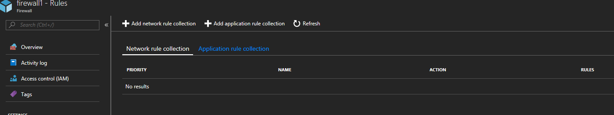
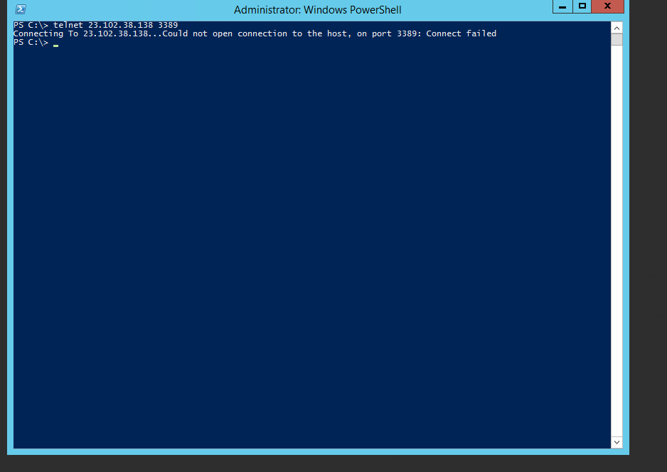
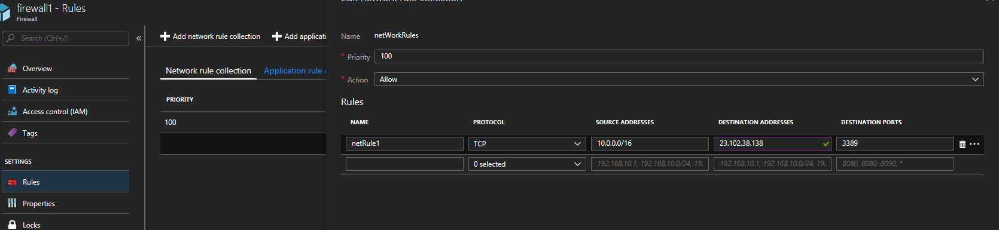
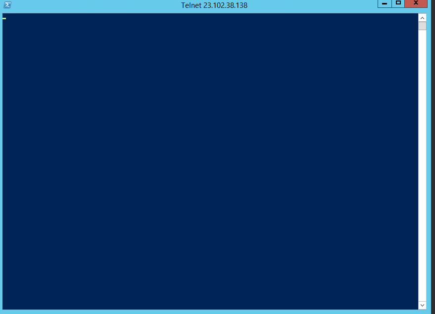
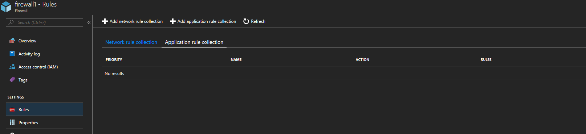
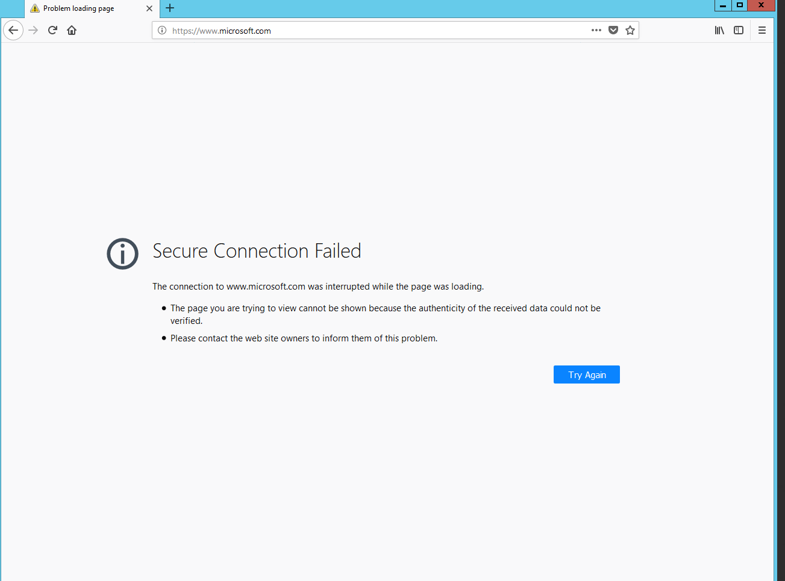
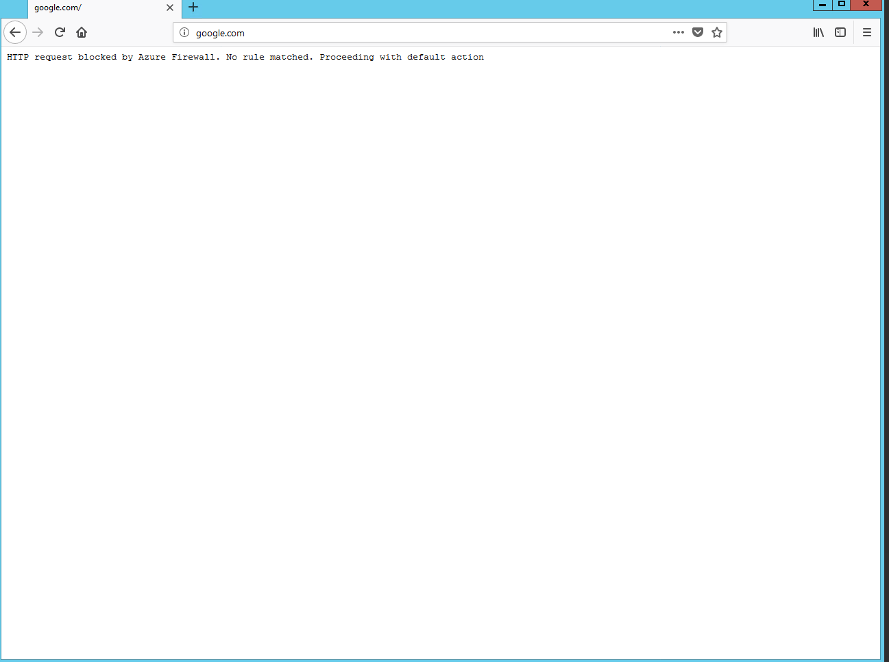
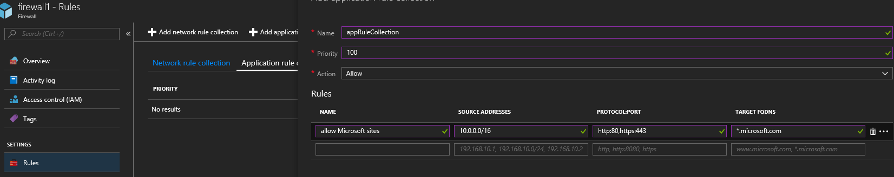
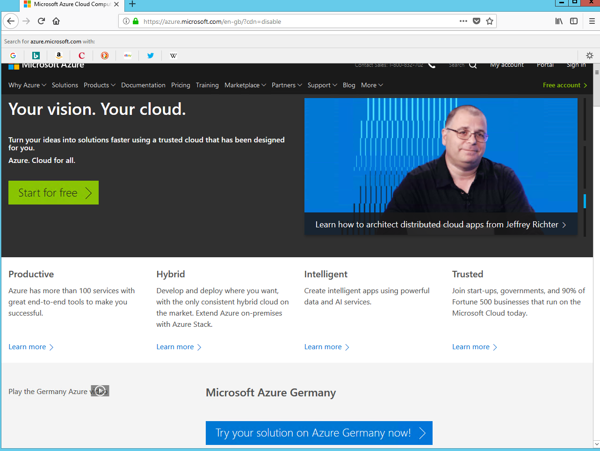

[What is Azure Firewall](https://docs.microsoft.com/en-gb/azure/firewall/overview) \- A fully stateful firewall as a service.

Before you can deploy Azure Firewall you need to register the provider in your subscription : [https://docs.microsoft.com/en-us/azure/firewall/public-preview](https://docs.microsoft.com/en-us/azure/firewall/public-preview)

Register-AzureRmProviderFeature -FeatureName AllowRegionalGatewayManagerForSecureGateway -ProviderNamespace Microsoft.Network

Register-AzureRmProviderFeature -FeatureName AllowAzureFirewall -ProviderNamespace Microsoft.Network

It can take up to 30 minutes for the feature registration to complete

The easy way to get going and play with Azure Firewall is to use the quickstart template [https://github.com/Azure/azure-quickstart-templates/tree/master/101-azurefirewall-sandbox](https://github.com/Azure/azure-quickstart-templates/tree/master/101-azurefirewall-sandbox)

I've used the above template to get up and running with Azure Firewall quickly, easily and so I don't have to click around in the portal.

First up is Network Rules - the template deploys adds an example rule in which I have deleted so I can start from scratch.  At the moment I have no network rules in my firewall

If I now try to telnet to another server of mine that has RDP open to the internet we can see the connection is not successful

I now add a rule to my firewall:

And now the telnet connection to 3389 to the target is successful:

Next up is Application Rules.  Application Rules allow you to control what FQDNs can be accessed and, somewhat obviously, these rules are http and https based. Again the deployment I used created a single Application Rule which I have deleted to give me a clean slate from which to start:

Now if I try to browse the web from my server in Azure I'm blocked.  Interestingly the message I get in the web browser depends on whether I've gone to a https site or http:

I now add a rule for http and https for \*.microsoft.com

I can now browse to Azure.microsoft.com

 

To get the abilty to filter http/https traffic like this you'd have to deploy a Network Virtual Applicance (NVA) and to control what can route to where in your Azure infrastructure you'd require an NVA or something like a Linux IaaS server running iptables.

Azure firewall looks like a good solution to filtering internet traffic and for controlling routing between servers in Azure.  Compared to some NVA devices or iptables it may be more basic (at the moment) but it certainly does offer what I see a lot of people asking for.
