I've recently had the opportunity to start playing with [Azure Devops](https://azure.microsoft.com/en-gb/services/devops/) and as I'm historically and primarily an infrastructure guy I wondered how Azure Devops can help me with such things as Infrastructure as Code.

What I'll show in this post is how to deploy ARM infrastructure resources such as VMs and vnets using ARM templates and Azure Devops.  I'm not going to go into how you can purchase Azure Devops, there are many ways to gain access to it [https://azure.microsoft.com/en-gb/pricing/details/devops/azure-devops-services/](https://azure.microsoft.com/en-gb/pricing/details/devops/azure-devops-services/)

so I'm going to dive straight into how I deploy ARM templates with Azure Devops.

First an overview of what I'm going to be using:

Azure Devops (obviously)

Azure Repos (Azure repos are a git repo)

Build Pipeline

Release Pipeline

And my aim here is to deploy an Azure virtual network using Azure Devops

Your Devops URL is https://dev.azure.com/yourorgname

Step 1 - Create a Project

When first going to Azure Devops this is the page I'm greeted with:

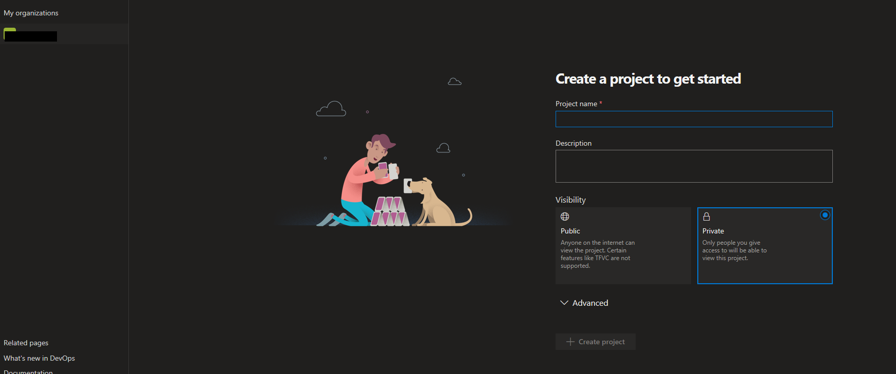

I create a project called 'Azure Infrastructrure' and leave the visibility set as Private.  When the projected is created I'm shown a 'Welcome to the project' screen

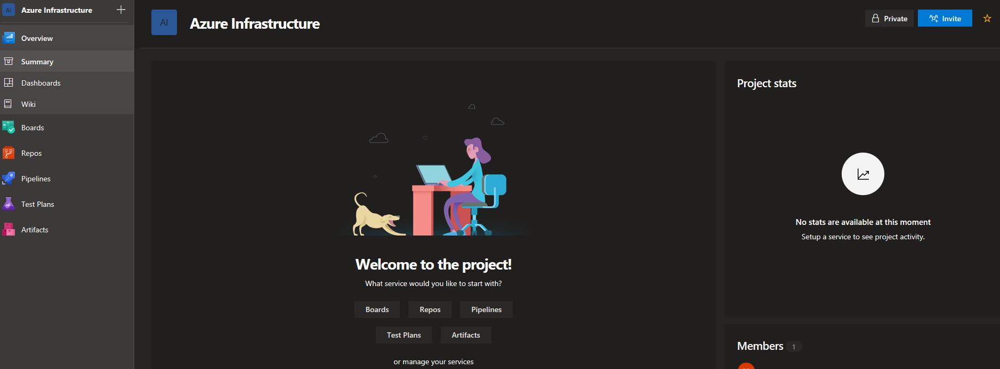

Down the left hand side you can see items such as Boards, Repos, Pipeleines, test Plans and Artifacts.  I'll only be dealing with Repos, and Pipelines.

Firstly I choose Repos and I choose 'or initialze with a Readme' to create a new repo and click intiialize.  Note you also have options to clone the repo to your computer or push an existing repo.  For simplicity I'll just be initializing a new repo.

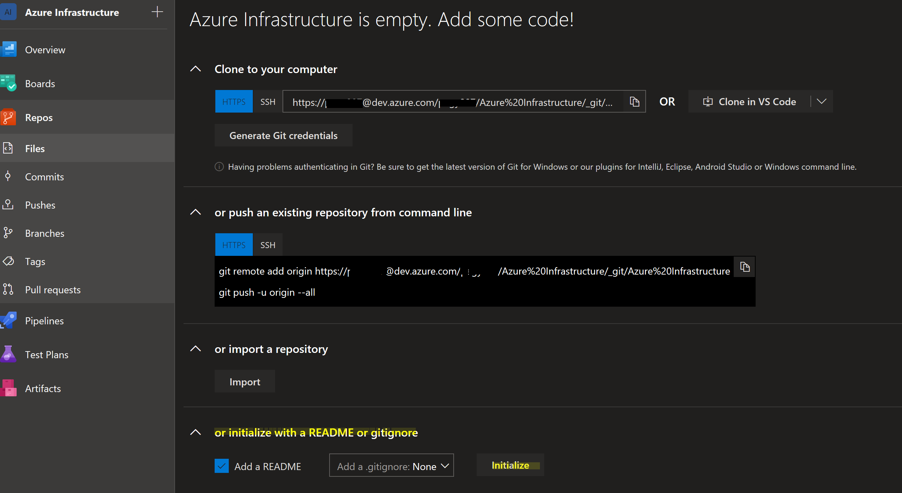

An empty repo is created:

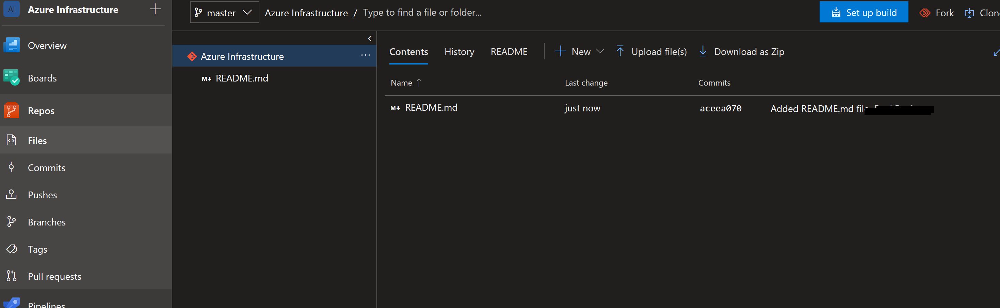

I'm going to create a new folder called ARM-Vnet by selecting New - Folder.  Note that you cannot create an empty directory so you have to create a placeholder file when you create the directory:

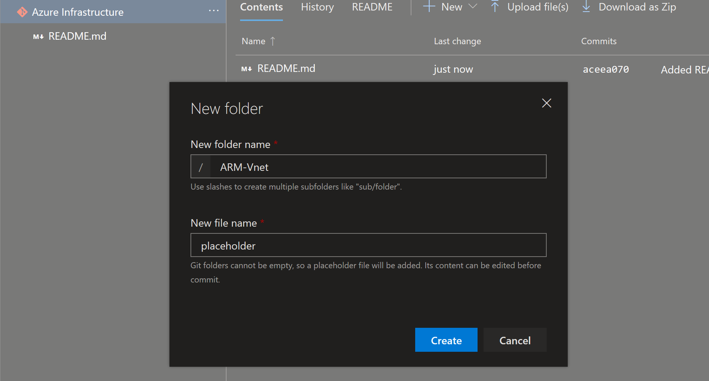

I'm also going to create a folder called ARM-VMs

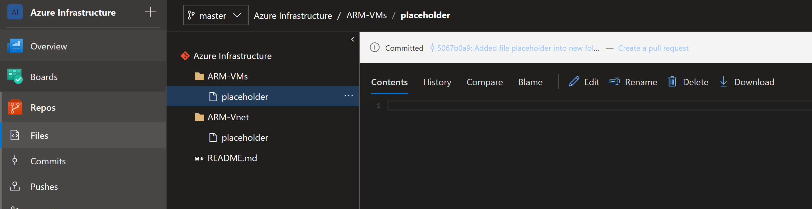

I upload some existing ARM templates that I have for creating a vnet and virtual machines into the relevant folders.

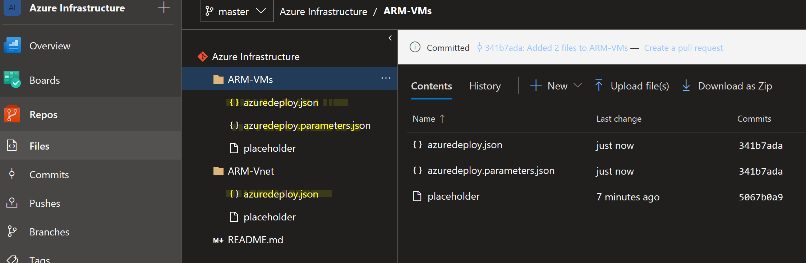

**Build Pipeline**

The next step is to create a build pipeline.  You can read more about pipelines [here](https://docs.microsoft.com/en-gb/azure/devops/pipelines/get-started/index?view=vsts)

Select Pipelines - Build - New Pipeline

In the new pipeline window select 'Use the visual designer to create a pipeline without Yaml'  It doesn't look like a selectable item but 'Use the visual designer' section is.

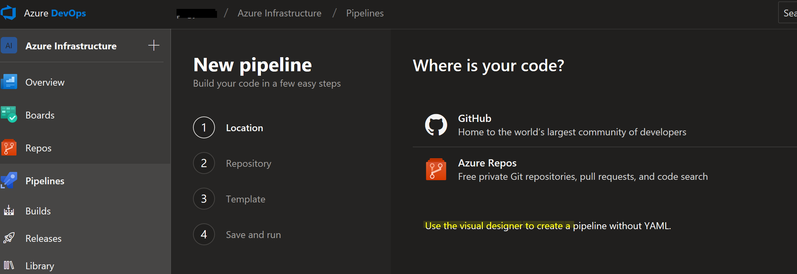

Select your source repository.  As mentioned earlier I'm using Azure Repos

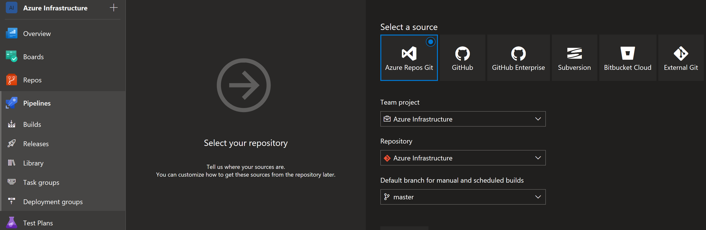

Select Continue

On the select template page choose 'Start with an empty job' and the build pipeline is created and immediately opens up for you to start customising the pipeline.  Note that by default it names the pipeline after your project and appends -CI to it.

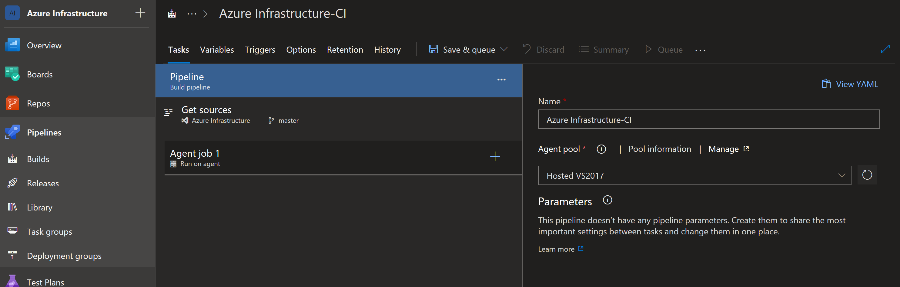

Click on the + sign in Agent job 1.

Search for azure

Select Azure Resource Group Deployment and click Add to add Azure Resource Group Deployment to the agent job

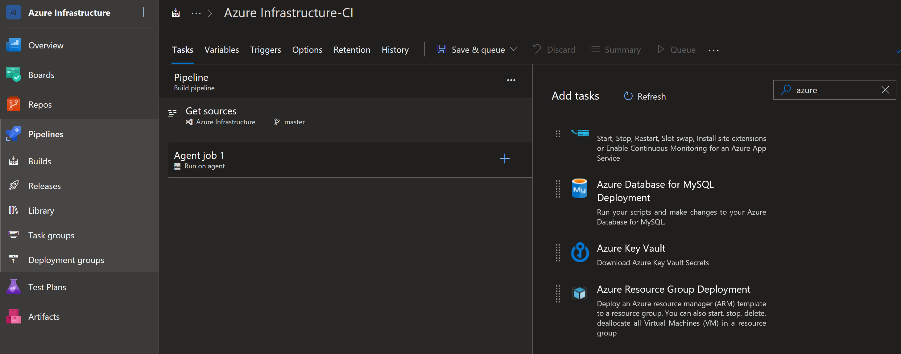

Fillout the following details in the task:

Change the name of the deployment if you wish

Select the Azure subscription.  A note on selecting the Azure subscription, in my example my account is in the same Azure AD Tenant as where I'm going to target the deployment of my resources, so I can select authorize.  If this is not the case you need to create service connection between Azure Devops and the Azure AD Tenant to enable the deployment of resources from Azure Devops.  More on this at [https://docs.microsoft.com/en-us/azure/devops/pipelines/library/connect-to-azure?view=vsts](https://docs.microsoft.com/en-us/azure/devops/pipelines/library/connect-to-azure?view=vsts)

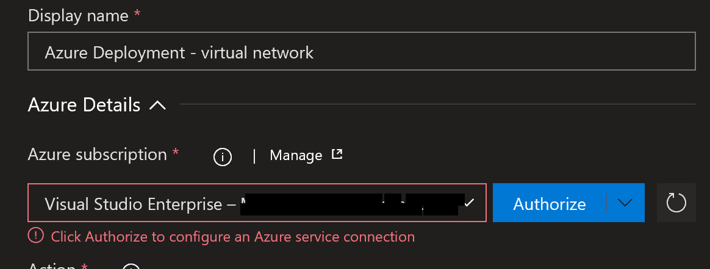

Action - Create or Update Resource Group

Select an existing resource group or set a name for a new resource group

Set the location

Browse and select the to ARM template located in our repo

Browse and select the ARM template parameters if required

Deployment Mode - set to Validation Only

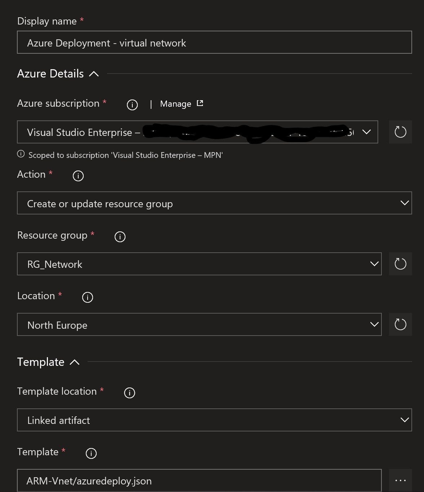

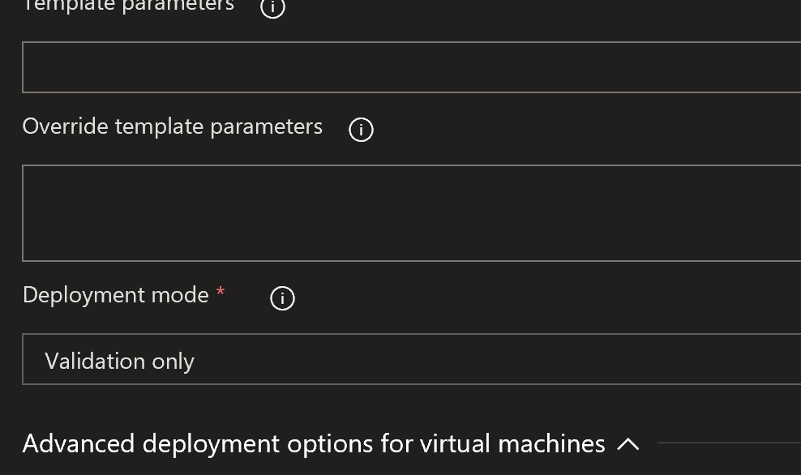

Click + on the agent job again and add a 'Copy Files' task.  Give the task a name and set the options as follows:

Set the source folder to the folder holding the relevant ARM template.  In my case this is my ARM-Vnet folder, under which is the ARM template for my virtual network.

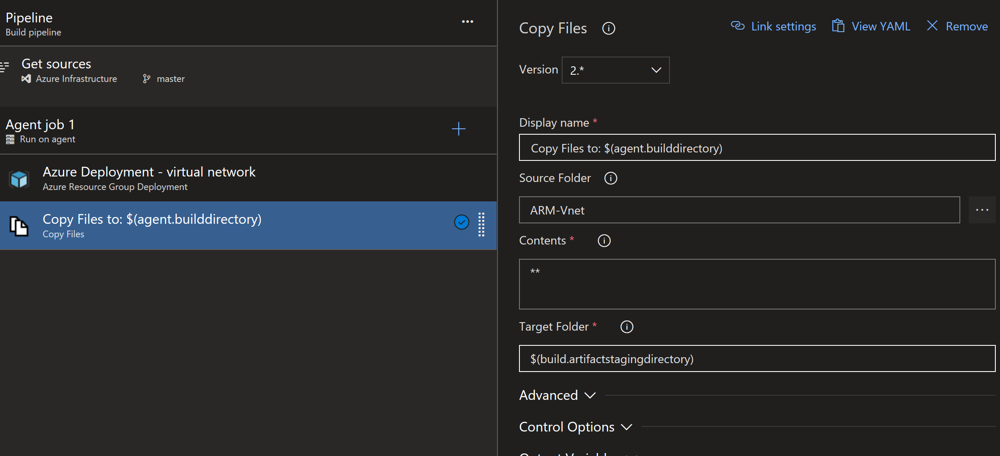

Click + on Agent job 1 to add a new task and choose 'Publish Build Artifact'

All the options can be left at their defaults for this task

Save the pipeline by clicking the arrow next to 'Save and Queue' and select Save.  We have now finished our build pipeline.  What does this do exactly?  It runs a validation against our ARM template, which is equivalent to Test-AzureRMResourceGroupDeployment cmdlet or the Azure CLI az group deployment validate command.  It checks that our template is syntactically correct and then copies it to the agent build directory (a directory on a VM essentially that is used to run the pipeline is my understanding) and then publishes that template as an artifact.

When defining the Azure Resource Group Deployment I specified a resource group called RG\_Network, if we look at my current resource groups in my subscription we'll see that no such resource group exists yet:

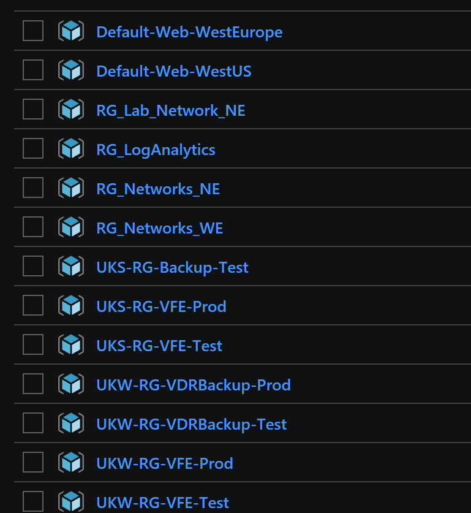

In the build pipeline if I now select 'Queue'

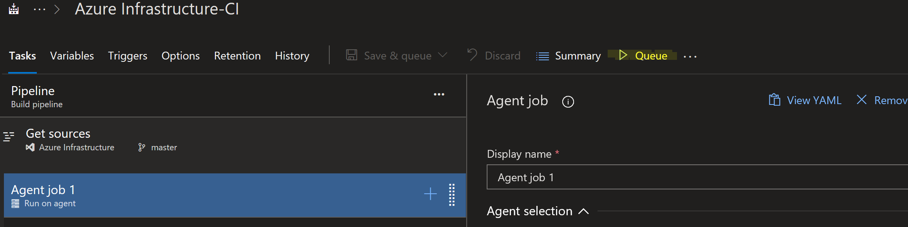

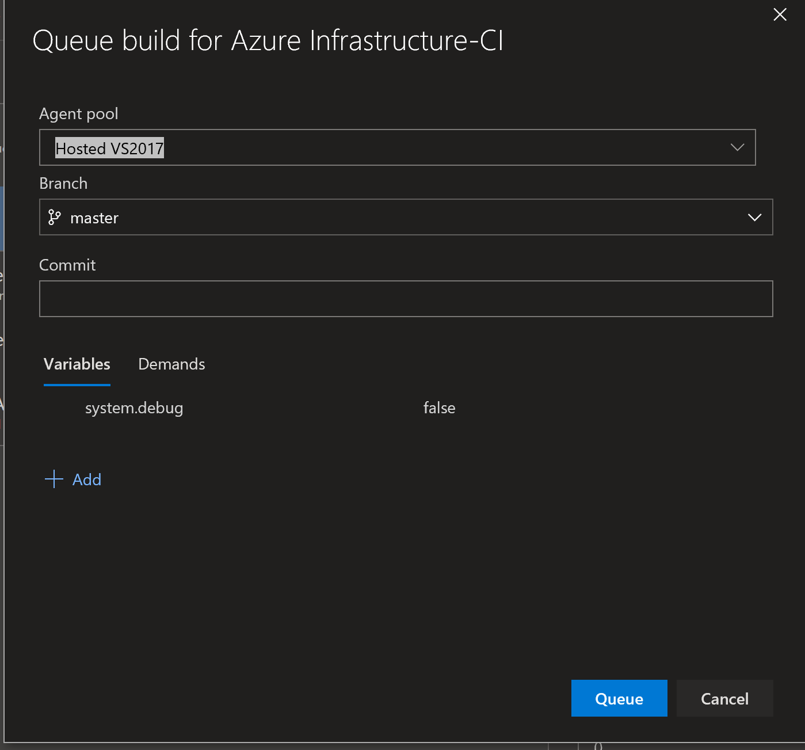

Leave all the options and click Queue.  A message near the top of the page reports that the request has been queued and shows you the build number.  You can click that message to see the Build

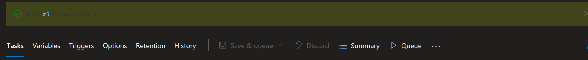

Once the build has completed successfully the resource group RG\_Network has been created in my Azure subscription but there are not resources in the resource group.

\[gallery ids="1337,1338" type="rectangular"\]

 

The resources will be deployed via our release pipeline in part 2.
