In part one we setup a project in Azure Devops, create an Azure repo, added an ARM template to the repo and created a build pipeline.  In this post we'll create a release pipeline to actually deploy our resources in Azure.

Within Azure Devops open our project and select 'Releases' and select 'New Pipeline'

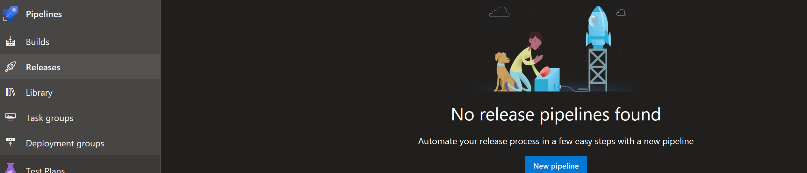

On the next page choose under select template choose 'Start with an empty job'

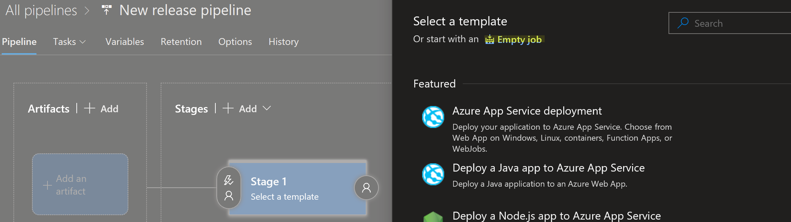

By default the stage is called Stage 1 as per the above screenshot, I've renamed mine to Deployment

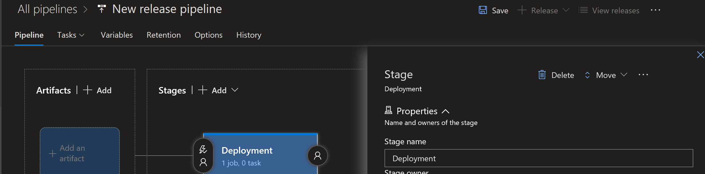

The point of stages are the different releases to environments you might have such as dev, stage, production.  You can add these stages in and release to each individually.  Understanding this was key to me in understanding why tools such as Azure Devops are so very useful.  In this example I'm going to stick with the one stage though.

I now select Save and accept the default save location when prompted.  I then select 'Add an artifact'

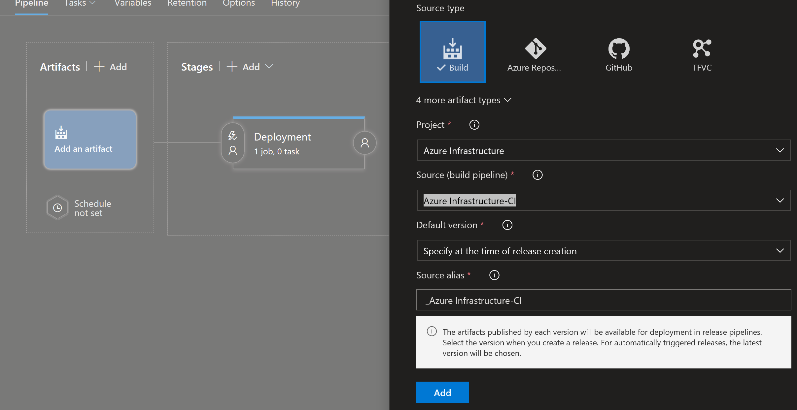

I select my Source, this is the build pipeline we created in part one. I leave everything else at default and select Add and then hit save.

In the deployment stage I click on 1 job, 0 task

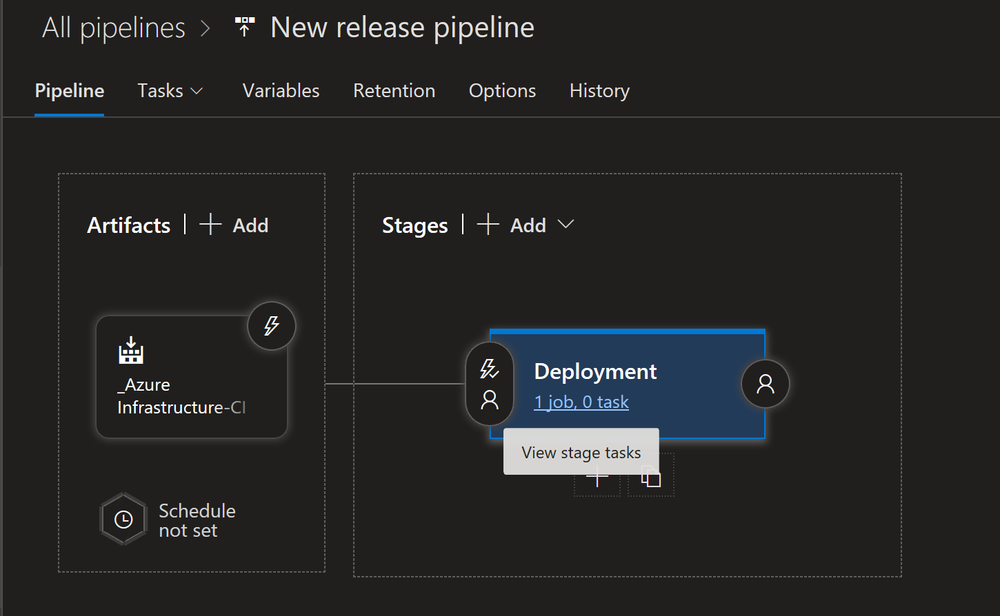

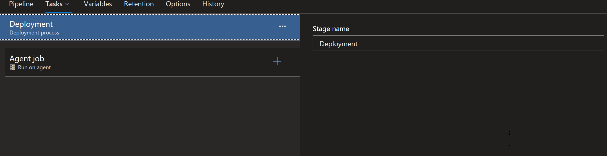

I click + in Agent job and search for and select 'Azure Resource Group Deployment'

In the Resource Group Deployment Task I set information such as the subscription to deploy to and the resource group.  In part 1 we said we'd deploy to a resource group called RG\_Network which was created by the build pipeline for us.

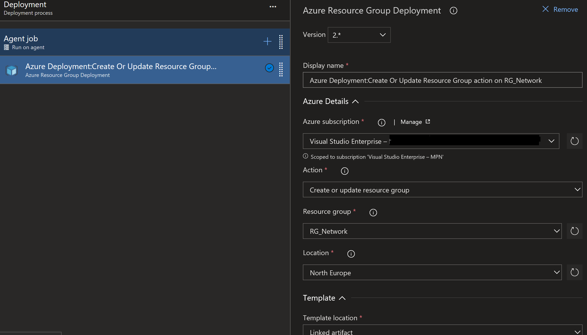

Leave Template Location as Linked Artifact and click the three dots by Template Location to browse to the artifact which was created for us by the build pipeline

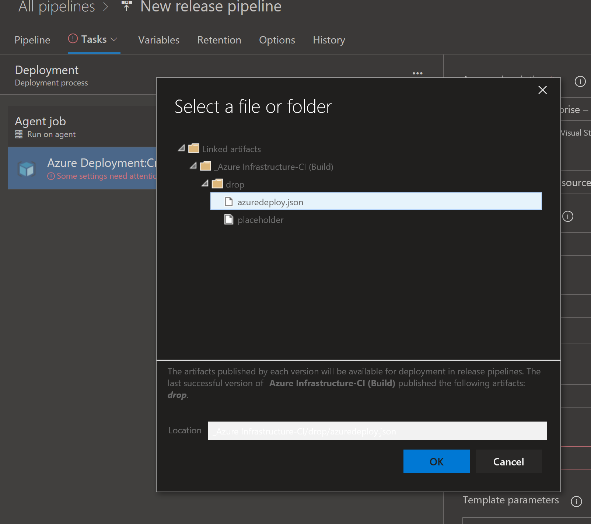

Hit Save

In the top right of the page select the down arrow by 'Release' and select Create A Release

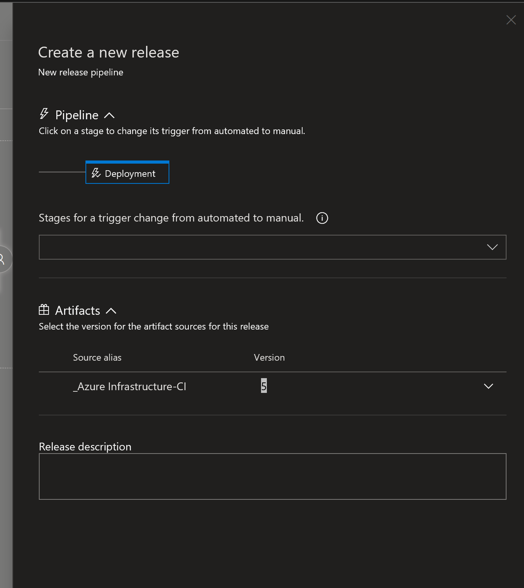

 

Leave everything except for 'Select the version for the artifact sources for this release'  Hit the drop down arrow and select your source artifact.  Click create and our release is created

A message appears saying the release has been created

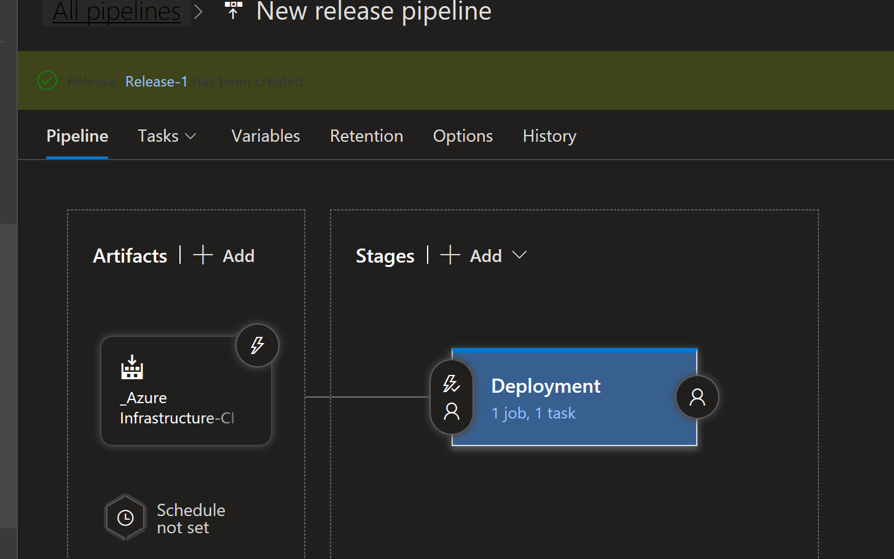

In my case it was called Release-1 and I can click on that to see the release details.  In my case the deployment happened very quickly as the ARM template is very basic and just deploys a vnet but we can see it said the deployment was successful.

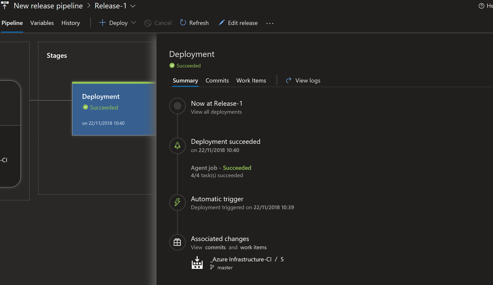

To see if it really was successful I can look in my RG\_Network resource group to see if the vnet was created

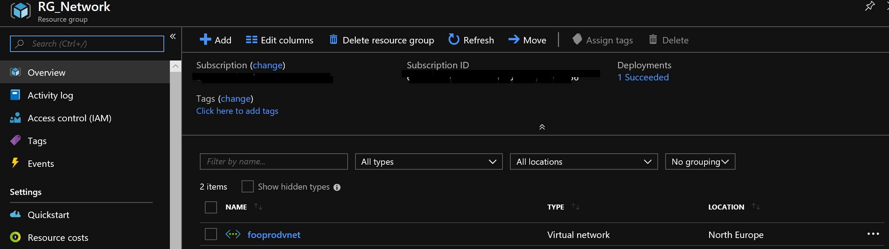

 

And it was.  Using Azure Devops I've deployed an ARM template which created a vnet in Azure.

Earlier in this post I made a comment about stages and how getting started with Azure Devops has helped me understand why tools like this are so useful.  The deployment stage I deployed to could easily have been called Dev or Test and then I can have another stage called Production.  The key bit here is it's the same ARM template being deployed in each stage so consistency of what is deployed is guaranteed across the stages.

Obviously there may be necessary changes between environments like test and production, such as IP addressing.  This can be handled with variables in the various stages to override the parameters of the ARM template.  I'll cover those and some other features in future blog post.  Obviously what has been done here is fairly simple, just a single ARM template deploying one vnet.  As I learn more about using Azure Devops I'll write it up :)
