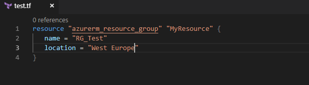
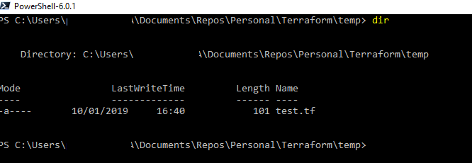
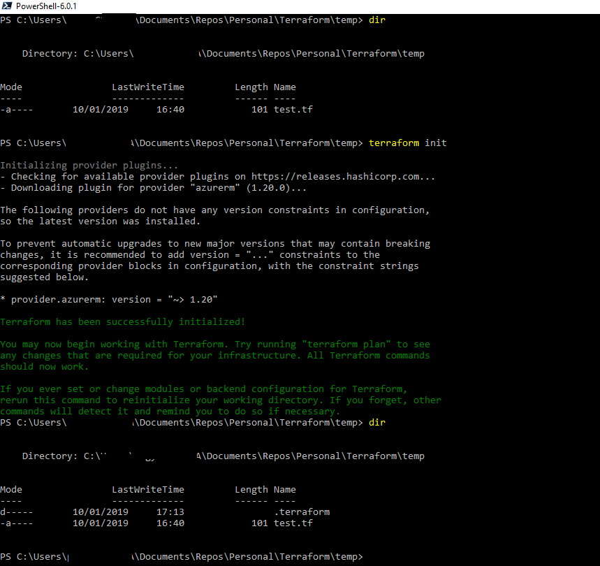
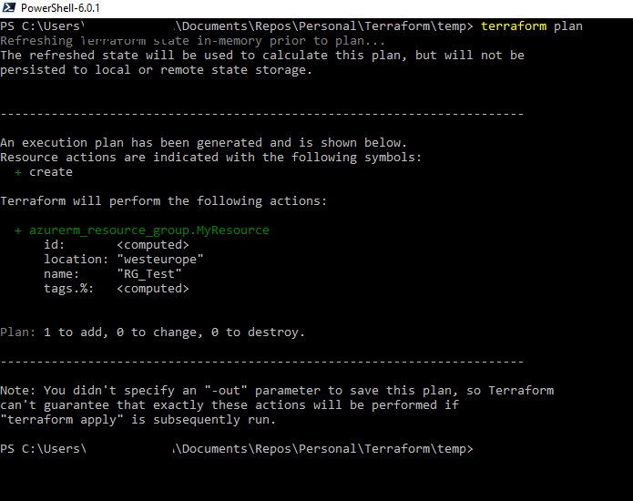
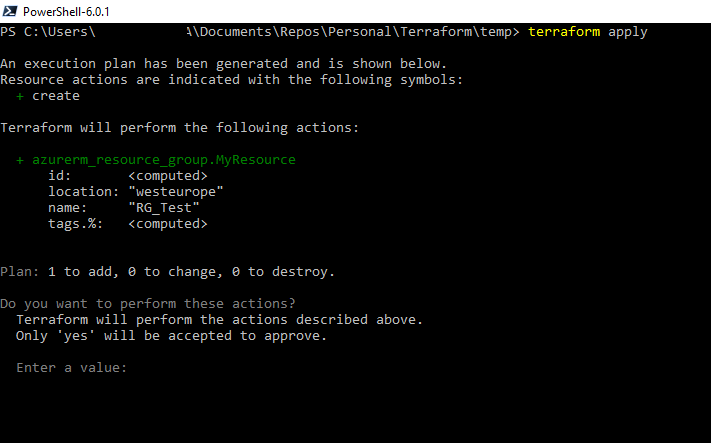
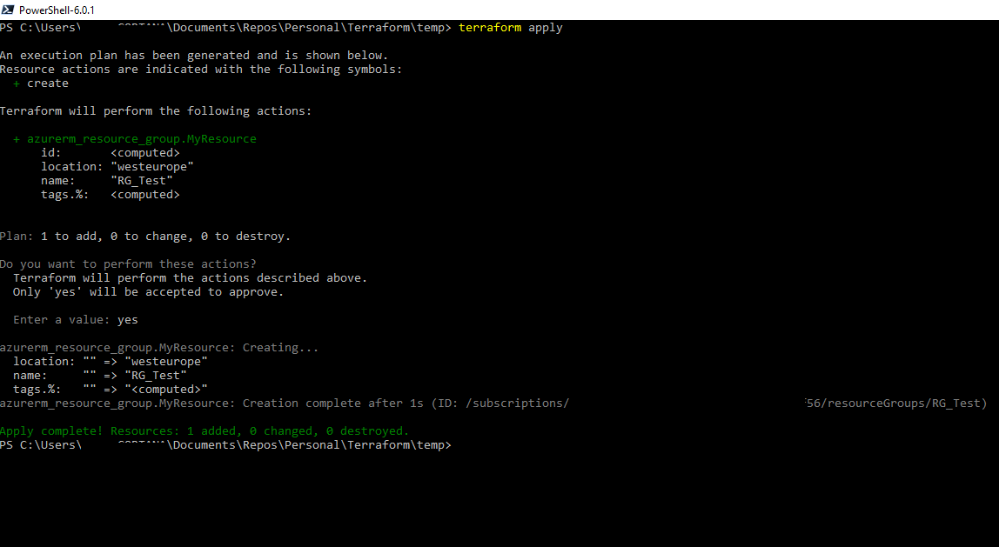
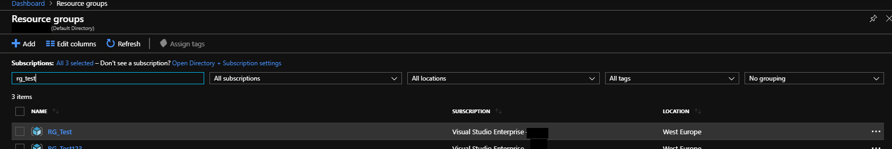

 

I've been increasingly using Terraform for my Infrastructure as Code deployments to Azure and I really like it and prefer it to using ARM templates.  The thing I like most about Terraform is that it's simple to use yet very powerful in its capabilities.

This post is not intended to be an in-depth introduction to using Terraform on Azure, there are many sites around who have done that already and do it very well.  I'll point to those resources as I go through some basic concepts and do a very simple deployment.

### Resources for learning Terraform:

[Azure Citadel](https://azurecitadel.com/automation/terraform/) is one of the best places to learn lots about Azure and they have a workshop on using Terraform.  This is where I started my Terraform learning.

Use the Terraform website:

[Terraform Intro](https://www.terraform.io/intro/index.html)

[Terraform Learn](https://learn.hashicorp.com/terraform/)

[Terraform Docs](https://www.terraform.io/docs/index.html)

[Installing Terraform](https://learn.hashicorp.com/terraform/getting-started/install.html)

The information on the Terraform is really very useful, the docs are not so verbose that reading them becomes a chore and I find them to be very clear and convey enough information.

#### A high level overview of Terraform:

Terraform configuration language is the [Hashicorp Configuration Language](https://github.com/hashicorp/hcl) (HCL) and the configuration files themselves have a .tf extension.

Above is a very simple configuration file with some configuration in it.  Let's break down that configuration a bit:

A [resource](https://www.terraform.io/docs/configuration/resources.html) is some part of your infrastructure, a virtual machine, container, virtual network or in the case of the above a resource group

The value 'azurerm\_resource\_group' is the resource type.  The resource type is prefixed with the [provider](https://www.terraform.io/docs/configuration/providers.html), which in this case is azurerm.

The 'MyResource' is a resource ID.  If you needed to reference this resource group later on in the configuration you could do so by referencing that ID.

'Name' is fairly obvious, it's the name I want my resource group to be called.  'Location' is obviously self-explanatory as well.

There are a couple of steps I need to do before deploying that configuration to Azure:

1) [Authenticate](https://www.terraform.io/docs/providers/azurerm/auth/service_principal_client_secret.html) to Azure in some way.  There is more than one way of doing so

Authenticate using the cli

A managed service identity

A service principal

I won't delve into those now but for the purposes this post I am authenticating using the Azure cli, that is I have the Azure cli installed on my Windows machine and I run 'az login' to authenticate to Azure.

2) Place the .tf file in a directory

3) Run terraform init.  This will initialize the working directory containing terraform configuration files.  The azurerm provider is downloaded into a subdirectory of the .terraform directory

4) Run terraform plan.  This generates an execution plan and is one of my favourite features of terraform.  The execution plan is going to tell me what terraform is going to do based on my configuration.

The terraform execution plan telling me what it is going to do when I go to the next stage of actually deploying the resources.  Above it is telling me that a resource group called RG\_Test will be created in the West Europe region.

5) Terraform apply.  Running this actually creates the resources in the configuration files

When I run terraform apply it actually shows me the execution plan again and I have to type 'yes' to proceed.  After typing 'yes' terraform creates the resources

 

 

To get started with Terraform I looked at the common architectures I use in Azure and set about putting that together in Terraform.

A common architecture I use in Azure is the [hub and spoke](https://docs.microsoft.com/en-us/azure/architecture/reference-architectures/hybrid-networking/shared-services) network design.  I've previously done that in an ARM template and with PowerShell so I decided to do it with Terraform as well, this time with an Azure firewall as well.  I also did some Terraform for creating x number of VMs and attaching them to an existing vNET. Both of these can be found on my github page

[Hub And Spoke vNet In Terraform](https://github.com/pagyP/Terraform/tree/master/network/hubandspoke)

[VM Deployment](https://github.com/pagyP/Terraform/tree/master/VMs/multi)

The configuration code on these is still a little rough but will be improved over time

This [github repo](https://github.com/pearcec/terraform-azure-palo-hub-spoke) really helped me with the configuration code for the hub and spoke network

 

I'll blog more about Terraform in the future
