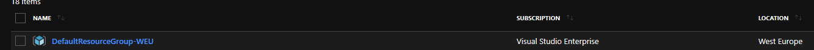
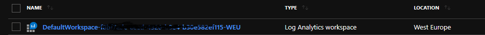
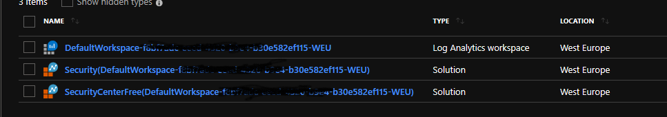
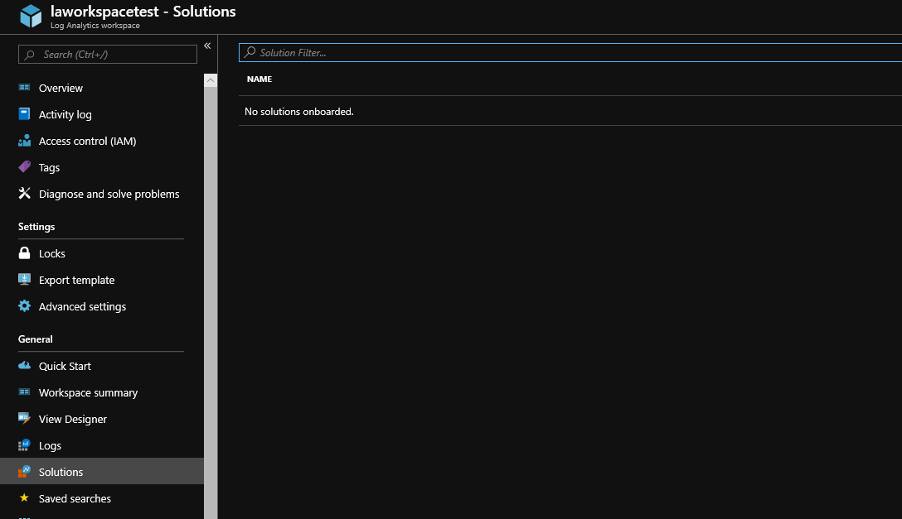
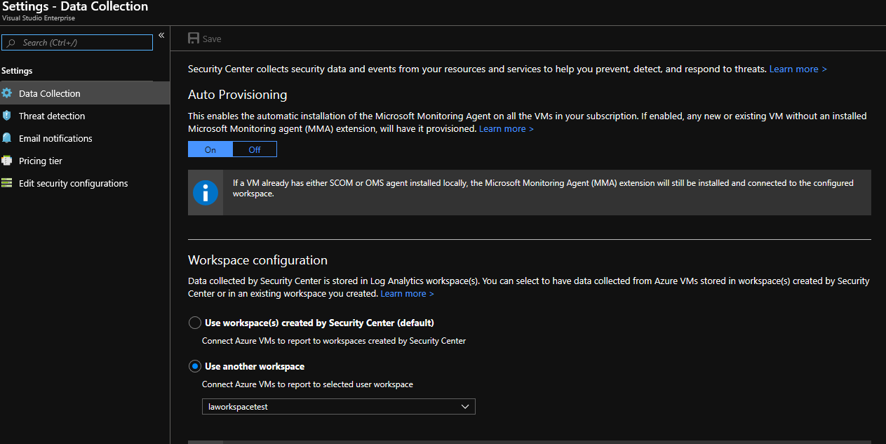
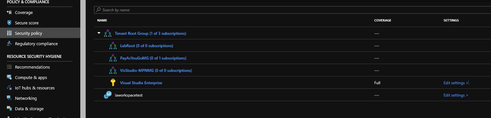
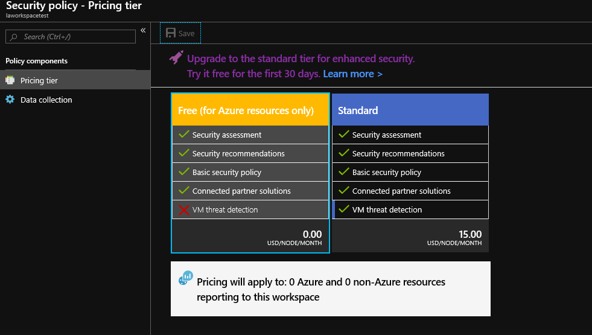
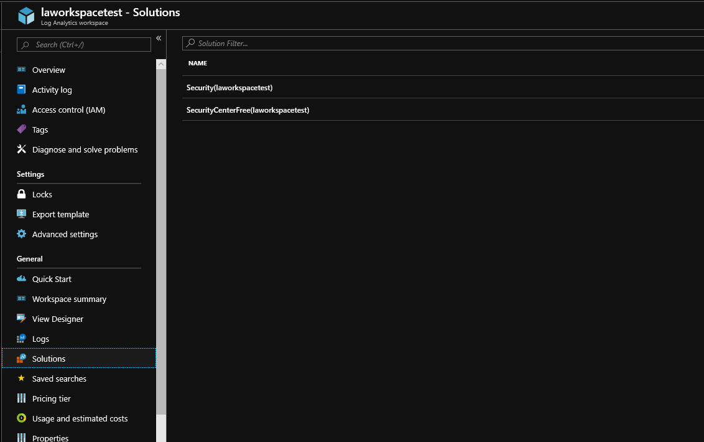

Azure Security Center is a good thing to have as part of your Azure resources and it comes in two tiers: Free or Standard. By default it is enabled in your Azure subscription at the free tier and changing that to standard unlocks additional [features](https://docs.microsoft.com/en-us/azure/security-center/security-center-pricing) and comes with some [costs .](https://azure.microsoft.com/en-us/pricing/details/security-center/)

So you've upgraded Security Center to standard and you have enabled [data collection](https://docs.microsoft.com/en-us/azure/security-center/security-center-enable-data-collection) and you chose the option '_Use workspace(s) created by Security Center (default)_'. All is good and you have your machines onboarded into Security Center and they are sending data to the workspace. So what actually happens when you do this?

A resource group is created called '  
DefaultResourceGroup-xxx' (where xxx is a region). For example in my subscription this was called '  
DefaultResourceGroup-WEU'

Default Security Center Workspace Resource Group

A log analytics workspace is created in the above resource group and this is called 'DefaultWorkspace- subscription guid-xxx (xxx is again the region)

Default Security Center Workspace

Within the log analytics workspace above two solutions are added:

Securitycenterfree

SecurityCenter

Security Center Solutions added to Log Analytics Workspace

Something that happens a lot is the above is configured but then you realise that a custom log analytics workspace should be used instead. This could be to align to a naming convention you use or because you use a centralised workspace for all data collection. Either way you now need to change Security Center to use a different workspace. The change is simple enough to do and is documented [here .](https://docs.microsoft.com/en-us/azure/security-center/security-center-enable-data-collection) From that article:

_"Select the pricing tier for the desired workspace you intend to set the Microsoft Monitoring agent.  
To use an existing workspace, set the pricing tier for the workspace. **This will install a security Center solution on the work**_**space** if one is not already present.

a. _In the Security Center main menu, select_ **_Security policy_**_._

b. _Select the desired Workspace in which you intend to connect the agent by clicking_ **_Edit settings_** _in the Settings column of the desired subscription in the list. "_

What this is saying is you need to update the tier of the log analytics workspace you are going to use for Security Center - doing so doesn't affect the pricing of the workspace itself, but what it does do is add the SecurityCenter solution to the workspace.

Here's what I'm about to do:

Create a new log analytics works called '_laworkspacetest_'

Update the Data Collection settings of Security Center to use _laworkspacetest_ - at this point there will not be any Securitycenter solutions in the log analytics workspace _laworkspacetest_.

Update the pricing tier of _laworkspacetest_ from within Security Center by following the documentation linked to previously - this will add the SecurityCenter solutions to the log analytics workspace _laworkspacetest_

laworkspacetest Log Analytics workspace without any solutions

In the below picture I have updated Security Center data collection settings to use the _laworkspacetest_ Log Analytics workspace:

Changing security Center to use a custom log analytics workspace  
  

I see the log analytics workspace _laworkspacetest_ under 'Security Policy' now and I have an option to 'Edit Settings' of the workspace

Log Analytics workspace under Security Policy

Clicking edit settings allows me to choose the free or standard tier

At this point I choose to switch to Standard and would then click save. What happens now is the SecurityCenter solution is added to the custom log analytics workspace.

The above is fine and all works well, but if you were doing more than one or two workspaces in this manner, or you are deploying to a greenfield site this is too much clicking for my liking.

You can update the log analytics workspace with the securitycenter solution by using PowerShell:

_Set-AzOperationalInsightsIntelligencePack -ResourceGroupName <your rg name> -WorkspaceName <workspace name> -IntelligencePackName "Security" -Enabled $true_

If you are deploying with Terraform use the resource  
[azurerm\_log\_analytics\_solution](https://www.terraform.io/docs/providers/azurerm/r/log_analytics_solution.html) and add the following plan:

<table class="wp-block-table"><tbody><tr><td>plan {</td></tr><tr><td>publisher = "Microsoft"</td></tr><tr><td>product = "OMSGallery/Security"</td></tr><tr><td>}</td></tr></tbody></table>

If you deploy using ARM templates you add a plan section under the resource type Microsoft.OperationsManagement/solutions as per  
[https://docs.microsoft.com/bs-cyrl-ba/azure/azure-monitor/platform/template-workspace-configuration](https://docs.microsoft.com/bs-cyrl-ba/azure/azure-monitor/platform/template-workspace-configuration)
